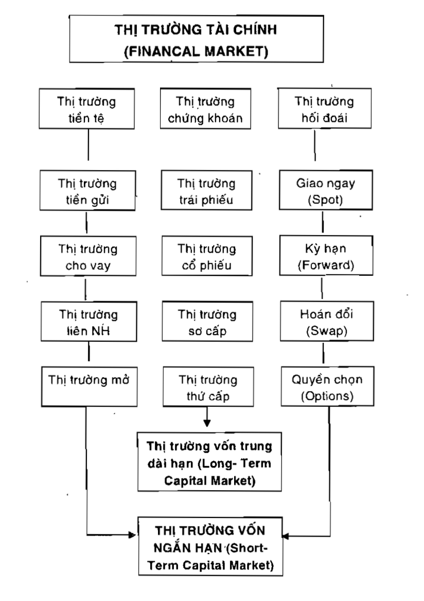

# Chương 1: Tổng quan về thị trường chứng khoán

## 1. Khái niệm về thị trường tài chính

Thị trường tài chính là thị trường trung gian nơi chuyển vốn từ nơi 'thừa' sang nơi 'thiếu'

Có 2 phương thức huy động vốn:
- Trực tiếp: người cần vốn sẽ phát hành một số loại giấy tờ (cổ phiếu, trái phiếu), người muốn cho vay vốn sẽ mua các loại giấy tờ này
- Gián tiếp: được thực hiện thông qua một định chế tài chính trung gian(ngân hàng, quỹ đầu tư,...)

## 2. Cấu trúc thị trường tài chính

Để tài trợ cho nhu cầu vốn ngắn hàng và dài hạn, mà thị trường tài chính chia ra 2 bộ phận:

### 2.1. Thị trường tiền tệ (money market)

Có thời hạn dưới 1 năm nên được được sử dụng để thu hút các nguồn vốn ngắn hạn, có độ an toàn cao

Các chủ thể tham gia vào thị trường tiền gửi gồm:
- Kho bạc nhà nước
- Ngân hàng trung ương
- Ngân hàng thương mại
- Công ty tài chính, tổ chức kinh tế
- Cá nhân trong xã hội

Gồm các thị trường sau:
- Thị trường tiền gửi
- Thị trường tín dụng
- Thị trường liên ngân hàng
- Thị tường mở
- Thị trường trái phiếu kho bạc

### 2.2. Thị trường vốn (capital market)

Gồm 3 loại chính:
- Thị trường chứng khoán (the securities market)
    - Cung cấp vốn đầu tư trung, dài hạn.
    - Nhà nước thường có các cơ chế chặt chẽ trong việc mua bán, phát hành nhằm hạn chế rủi ro cho nền kinh tế, xã hội.
    - Gồm:
        - Cổ phiếu
        - Trái phiếu chính phủ, công ty, chính quyền địa phương
- Thị trường cho thuê tài chính (financial leasing market)
    - Thị trường cho thuê tài sản
- Thị trường thế chấp (Mortgage Market)
    - Cho vay vốn trung, dài hạn bằng tài sản thế chấp.
    - Nếu chứng minh được dự án đủ tốt thì có thể vay tín chấp (không cần tài sản đảm bảo)

### 2.3. Thị tường hối đoái (Exchange market)

Nơi diễn ra hoạt động mua bán ngoại tệ

Nơi hình thành tỷ giá hối đoái then quan hệ cung cầu

## 3. Phân loại thị trường tài chính

Dựa trên cơ sở khác nhau mà cách phân loại của thị trường chứng khoán sẽ khác nhau

- Dựa trên tính chất phát hành, lưu hành chứng khoán, chia thành 2 loại:
    - Thị trường sơ cấp (primary market)
        - Bản chất là thị trường phát hành        
        - Phát hành chứng khoán ra công chúng lần đầu tiên
    - Thị trường thứ cấp (secondary market)
        - Bản chất là thị trường giao dịch
        - Thị trường chuyển nhượng quyền sở hữu chứng khoán
        - Không làm tăng hay giảm nguồn vốn chủ thể phát hành. Nhưng nó xác định giá trị thị trường của chứng khoán đó và ảnh hưởng để lần phát hành tiếp theo.
- Dựa trên tính pháp lý:
    - Tập trung
        - Hay còn được biết đến là sở giao dịch chứng khoán
    - Phi tập trung
        - Không thông qua sở giao dịch chứng khoán
- Căn cứ vào phương thức giao dịch
    - Thị trường giao ngay (Spot market):
        - Giá căn cứ vào hiện tại
        - Giao dịch ngay
        - Thường thanh toán luôn (hoặc chờ vài ngày)
    - Thị trường kì hạn hay tương lai (Future Market):
        - Giá căn cứ vào hiện tại
        - Giao dịch trong tương lai
        - Thanh toán trong tương lai

## 4. Chức năng, vai trò của thị trường tài chính

Chức năng:
- Công cụ huy động vốn cho nền kinh tế
- Khuyến khích tiết kiệm đầu tư trong xã hội

Vai trò:
- Đảm bảo thanh khoản (tiền mặt) cho sổ tiết kiệm đầu tư dài hạn
- Công cụ đo lường giá trị tích sản của doanh nghiệp, do doanh nghiệp được niêm yết trên thị trường phải gửi báo cáo tài chính hằng kì
- Thúc đẩy doanh nghiệp hoạt động minh bạch hiệu quả
- Chống lạm phát do cung cấp một kênh đê ngân hàng nhà nước phát hành trái phiếu lãi suất cao nhằm hút bớt dòng tiền khi cần

## 5. Tác động tiêu cực trên thị trường chứng khoán

Một vài hành động tiêu cực:
- Đầu cơ chứng khoán, tạo cung cầu giả, điều phối giá cả cổ phiếu trên thị trường
- Mua bán nội gián
- Bán khống
    - Là hành động bán chứng khoán mà mình không sở hữu
    - VD minh hoạ: mượn 10 cổ phiếu A, bán ngay, chờ giá giảm, rồi mua lại để trả nợ và ăn phần chênh lệch
- Đưa thông tin sai sự thật