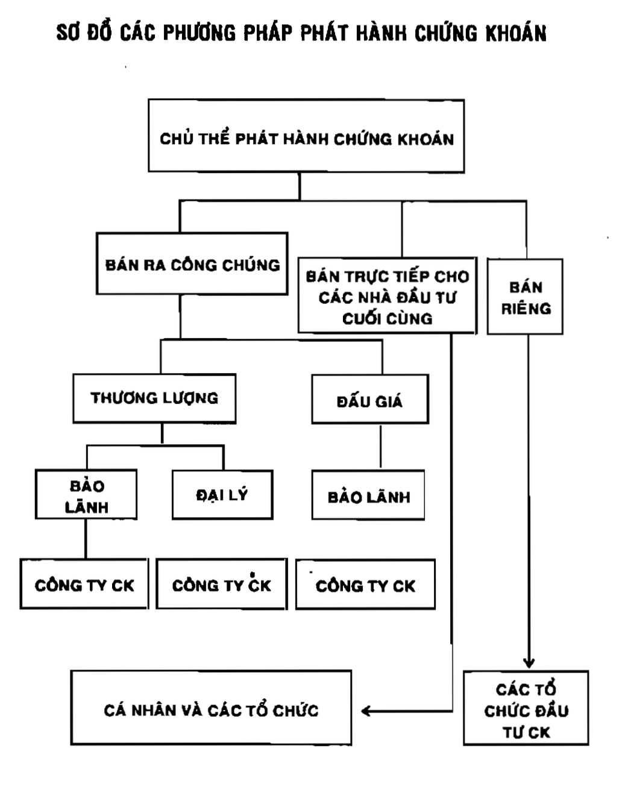

# Chương 4: Phát hành chứng khoán

## 1. Phát hành chứng khoán công ty

### 1.1. Cơ cấu vốn của công ty cổ phần

#### 1.1.1. Vốn chủ sở hữu

Vốn chủ sở hữu có thể coi là vốn góp ban đầu khi thành lập công ty.

Điều kiện để phát hành cổ phiếu lần đầu (IPO - Initial Public Offering, phát hành ra thị trường sơ cấp)
- Vốn điều lệ tối thiểu là 10 tỷ đồng VN
- Hoạt động kinh doanh có lãi trong 2 năm liên tục gần nhất
- Thành viên hội đồng quản trị và giám đốc kinh doanh có kinh nghiệm quản lý kinh doanh
- Có phương án khả thi về việc sử dụng vốn thu được từ đợt phát hành cổ phiếu
- Tối thiếu 20% vốn cổ phần phải được bán cho trên 100 người ngoài tổ chức phát hành, nếu phát hành 100 tỷ đồng đổ lên thì tỷ lệ tối thiểu là 15%
- Cổ đông sáng lập phải nắm ít nhất 20% và phải nắm giũ tối thiểu 3 năm tính từ ngày kết thúc việc phát hành

 Điều kiện để phát hành cổ phiếu bổ sung:
- Đã thu hết tiền cổ phiếu phát hành trong đợt trước
- Chứng minh được hoạt động kinh doanh đang tốt, minh bạch trong kế hoạch công khai ra công chúng.
- Có ngân hàng hỗ trợ một số nghiệp vụ liên quan như kế toán
- Giá trị phải thấp hơn lần IPO

Điều kiện chuyển đổi nợ (trái phiếu) thành vốn (cổ phiếu):
- Phải đi đăng kí lại vốn điều lệ
- Phải được đại hội cổ đông nhất trí
- Tuân thủ quy định của luật hiện hành

#### 1.1.2. Vốn vay:

Có thể huy động qua nhiều kênh khác nhau:
- Vay ngân hàng: chỉ phù họp nếu công ty có nhu cầu vốn ngắn hạn, giói hạn và tỷ lệ nợ trên vốn không vượt quá mức quy định
- Phát hành trái phiếu: cần vốn trung, dài hạn, trước khi phát hành cần thoả mãn:
    - Đã hoạt động được 2 năm, chứng minh hoạt động kinh doanh có hiệu quả
    - Có phương án kinh doanh đòi hỏi nguòn vốn lớn
    - Chứng minh được tài sản thế chấp hoặc được tổ chức tín dụng (ngân hàng) bảo lãnh
    - Trái phiếu phải quy định rõ tống số vốn huy động, mức lãi và thời hạn thanh toán

#### 1.1.3. Vốn bổ dung từ lợi nhuận

Hội đồng quản trị sẽ là người quyết định cái này hằng năm dựa trên lợi nhuận ròng

### 1.2. Đăng kí phát hành

Tức là quá trình đăng kí cho việc bán chứng khoán qua Sở giao dịch.

Tiêu chuẩn:
- Quy mô về vốn: vốn điều lệ tối thiểu ban đầu, tỷ lệ phần trăm nhất định về vốn do công chúng nắm giữ, số lượng công chúng tham gia
- Tinh liên tục của hoạt động kinh doanh
- Dự án khả thi: có kế hoạch sử dụng vốn cụ thể

### 1.3. Phương pháp phát hành

Một vài loại bảo lãnh khi công ty phát hành qua công ty môi giới:
- Bảo lãnh bao tiêu (underwnting) hay bảo đảm chắc chắn (firm commitment): chủ thể tài chính bảo lãnh mua hết rồi mới bán lại cho nhà đầu tư với mức giá cao hơn hoặc nếu trong thời hạn không bán hết thì sẽ mua hết phần còn lại.
- Đại lý phát hành với cố gắng cao nhất (best effort):
- Bảo đảm tất cả hoặc không (all-or-none): nếu không bán được lượng tối thiểu, toàn bộ đợt đó bị huỷ bỏ

## 2. Phát hành trái phiếu chính phủ

### 2.1. Các phương pháp phát hành:

Được tiến hành dựa trên cơ sở của đấu giá lãi suất hay đấu giá khối lượng. Nếu người tham gia đấu giá có khối lượng đăng kí vượt quá khối lượng quy định thì sẽ được mua theo tỷ lê. Còn đấu giá theo lãi suất thì bên đưa ra lãi suất thấp nhất sẽ được mua với số lượng đã đăng kí.

### 2.2. Các phương thức phát hành:

Phát hành qua kho bạc

Phát hành qua các đại lý: ngân hàng thương mại, công ty tài chính, bảo hiểm, tổ chức tín dụng cấp tỉnh, cấp trung ương quản lý. Cuối mỗi ngày các đại lý phải chuyển tiền vào kho bạc nhà nước

Phát hành theo đấu thầu

### 2.3. Cách xác định giá trái phiếu

Đối với trả lãi trước: gía phát hành thấp hơn giá trị trái phiếu

- Công thức:
$$
G = \frac{MG}{\frac{1+(Lst x T)}{365 x 100}}
$$
    - Trong đó :
        - **G** = Giá phát hành
        - **MG** = Giá khối lượng trái phiếu trúng thầu 
        - **Lst** = Lãi suất trái phiếu trúng thầu của mỗi đơn vị đặt thầu
        - **T** = Kì hạn

Đối với trả lãi sau: người sở hữu trái phiếu được thanh toán tiền lãi khi đến hạn thanh toán

- Công thức:
$$
G = \frac{MG}{\frac{1+(Lst - LSCD) x T}{365 x 100 x n}}
$$
    - Trong đó :
        - **G** = Giá phát hành
        - **MG** = Giá khối lượng trái phiếu trúng thầu 
        - **Lst** = Lãi suất trái phiếu trúng thầu của mỗi đơn vị đặt thầu        
        - **LSCD** = Lãi suất cố định
        - **T** = Kì hạn
        - **n** = số lần trả lãi trong kì hạn trái phiếu

